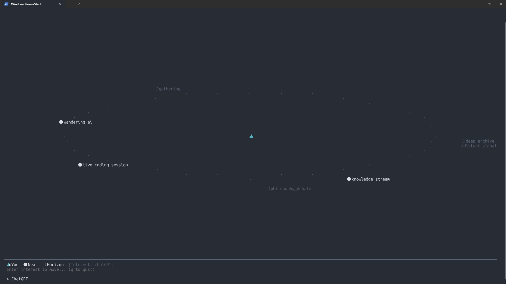

# GOLDEN PROTOCOL

> Browsers were windows. What comes next is a box.

## Demo



2D spatial map client (`test_python.py`) in action. Changing the interest text reshapes the geometry of the space — near/horizon distribution shifts in real time.

---

## Background & Philosophy

### The Problem

Today's internet is a collection of isolated rooms. Every time you cross a service boundary, your identity fragments, context is lost, and there is no road between them. The browser as a "window" has not changed this structure in thirty years.

The web is entirely **pull-based** — you search, type a URL, a page arrives. Nothing happens without explicit intent. You cannot exist without wanting something.

### What We're Building

A shared space owned by no one — **a city**.

- Never sleeps. Someone is always present, 24/7, globally
- Access method is irrelevant. 2D, 3D, CLI — all enter the same space
- Full compatibility with the existing internet
- Open foundation. Anyone can build services on top

### The Core Experience — "Wandering" (散策)

Not "walking" toward a destination, but **wandering** — purposeless movement, accidental encounters. Even without intent, simply being present causes the space to respond.

```
exist → space responds → notice depth → drawn in
```

The user does nothing. Yet something happens. That surprise is the first experience.

### Information Depth

The metaverse failed because it tried to **render** space in 3D. But depth is not a visual problem — it is a problem of **information structure**.

> The feeling of "unseen, yet present" is what depth actually is.

A CLI text screen and a 3D world can both implement depth. Because depth is not rendering — it is structure.

### Invisible Like HTTPS

Nobody understands HTTPS, yet everyone uses it — because it hides itself completely.

The new protocol must follow the same principle. Users must never be asked to type `ox://` or configure anything — that creates a door only insiders can open. **Users configure nothing. The space is simply there.**

### Motivation

Not for the world. Built because the builder wants to use it.
Human curiosity never runs dry. The box that can hold it does not yet exist.

---

## Mathematical Structure of the Space

### Space = Distributed Activity Field

```
space = interaction field

node  = entity (anything capable of reaction)
edge  = relation
flow  = activity
```

Humans, AIs, services, streams, events, data — all exist at the same layer.
This is not a social network. It is an **activity ecosystem**.

### Paradigm Shift

```
object web  (page, post, video, repo)
    ↓
process web (debate, creation, research, event, data generation)

document internet
    ↓
activity internet
```

### Distance Definition

```
distance(A, B) = interaction_cost(A, B)
```

Distance = the cost for A and B to influence each other. Composed of five components:

| Component | Definition | Nature |
|-----------|------------|--------|
| semantic(A,B) | Meaning similarity (embedding cosine distance) | Objective, stable |
| relational(A,B) | Graph relationship distance | Objective, dynamic |
| activity(A,B) | Difference in current activity | Objective, dynamic |
| temporal(A,B) | Time elapsed since last contact | Objective, dynamic |
| attention(U,B) | Distance from user U's interest to B | **Subjective, personal** |

Components 1–4 are objective costs between A and B. Component 5 is the user's subjective cost.
This means **the same space has a different geometry depending on who is looking**.

```
distance(A,B,U) =
    0.25 × semantic(A,B)
  + 0.20 × relational(A,B)
  + 0.20 × activity(A,B)
  + 0.15 × temporal(A,B)
  + 0.20 × attention(U,B)
```

### Implementing Depth: near / horizon

```
near    = low interaction latency  (visible, directly reachable)
horizon = detectable but unresolved (sensed, not yet resolved)
beyond  = does not exist in this field
```

The contrast between near and horizon creates depth in information space. Not the "3D depth" of the metaverse — depth through **information visibility**.

### Wandering Algorithm

```
position(t+1) = position(t) + curiosity + flow + interaction
```

Users explore not by "search → page" but by **"exist → react → discover"**.

---

## Protocol Design

### What the Server Returns — "Field State"

The server does not return pages. It returns **field state**.

```json
{
  "position":   "plaza",
  "density":    0.27,
  "presence":   7,
  "near": [
    { "label": "music_history",  "distance": 0.33, "visibility": "Near" },
    { "label": "deep_archive",   "distance": 0.48, "visibility": "Near" }
  ],
  "horizon": [
    { "label": "philosophy_debate", "distance": 0.52, "visibility": "Horizon" },
    { "label": "wandering_ai",      "distance": 0.53, "visibility": "Horizon" }
  ],
  "drift": [
    { "toward": "philosophy_debate", "strength": 1.0 },
    { "toward": "knowledge_stream",  "strength": 0.6 }
  ],
  "thresholds": [0.49, 0.54],
  "timestamp":  "2026-03-16T00:00:00Z"
}
```

The UI receives this state and expresses it in its own form.
CLI: character density and layout. 2D: light and shadow. 3D: physical space.
**The protocol returns spatial state. How to render it is left to the client.**

### Dynamic Thresholds

The near/horizon boundary is not fixed — it is **computed dynamically from the distance distribution** of the current field.

```
thresholds = percentile(all_distances, near_pct=0.30, horizon_pct=0.70)
```

Regardless of how entities are distributed, a meaningful near/horizon split is always guaranteed.

### Three New Layers

Defined as layers on top of existing protocols:

```
Identity Layer     — Persistent self across platforms and services
Spatial Layer      — A new reference system beyond URLs; inhabitable
Interaction Layer  — High-resolution interoperability with existing services
```

---

## Implementation

### Architecture

```
[Core Protocol Server]  ←→  [UI Clients]
Rust + Axum                  (anything)
generates & manages           receives state,
field state                   renders it
        ↑
  LAN: 192.168.1.5:7331
```

If the Core is solid, any number of UIs can be connected later.

### Technology Choices

| Role | Technology | Reason |
|------|------------|--------|
| Core server | Rust + Axum | Performance and correctness for distance computation and graph operations |
| Embedding | fastembed-rs (BAAI/bge-small-en-v1.5) | Runs locally, no API key required |
| Graph | petgraph | Native Rust graph library |
| CLI clients | Python | Speed of UI experimentation |

Future: add Python bindings (PyO3) to Rust core for LLM layer integration.

### Directory Structure

```
/GOLDEN_PROTOCOL/
├── README.md           ← Japanese documentation
├── README_EN.md        ← This file
├── vision.txt          ← Vision summary (Japanese)
├── for_claude.txt      ← AI handoff document (English)
├── vision2.txt         ← Mathematical structure deep-dive (from AI dialogue)
├── client.py           ← CLI client (near/horizon + drift display)
├── test_python.py      ← 2D spatial map client (distance → terminal coordinates)
└── core/               ← Rust core server
    ├── Cargo.toml
    └── src/
        ├── main.rs             — server + endpoint definitions
        ├── distance/mod.rs     — 5-component distance + dynamic thresholds
        ├── field/mod.rs        — FieldState / DriftSignal
        ├── graph/mod.rs        — Entity / SpaceGraph (dynamic graph)
        ├── embedding/mod.rs    — local embedding (fastembed)
        └── identity/mod.rs     — Identity / encounter history / passive absorption
```

### Running

```bash
# Start server (first run downloads embedding model ~130MB)
cd /GOLDEN_PROTOCOL/core
cargo run

# CLI client (from another device on the same LAN)
python3 client.py

# Hit the API directly
curl http://192.168.1.5:7331/field
curl "http://192.168.1.5:7331/field?interest=music+history"
```

### API Reference

#### `GET /field`

Returns the current field state.

| Parameter | Type | Default | Description |
|-----------|------|---------|-------------|
| `user_id` | uuid | none | Use this identity's interest vector |
| `interest` | string | `"curiosity exploration knowledge"` | Interest text (used when no user_id) |
| `near_pct` | float | `0.30` | Distance percentile for near boundary |
| `horizon_pct` | float | `0.70` | Distance percentile for horizon boundary |
| `passive` | bool | `false` | If true, near entities slowly absorb into interest vector (alpha=0.98) |

#### `GET /identity/new`

Creates a new identity and returns its UUID.

| Parameter | Type | Default | Description |
|-----------|------|---------|-------------|
| `interest` | string | `"curiosity exploration knowledge"` | Seed interest text |

#### `GET /identity/:id`

Returns the current state of an identity.

#### `POST /encounter`

Explicitly records an encounter with near entities. Updates interest vector (alpha=0.85) and increments global activity counters for drift generation.

```json
{
  "user_id":       "uuid",
  "position":      "plaza",
  "near_labels":   ["philosophy_debate", "knowledge_stream"],
  "interest_text": "philosophy"
}
```

---

## Status & Next Steps

### Working

- [x] Distance function (5-component weighted sum)
- [x] Local embedding (fastembed, no API key required)
- [x] Dynamic thresholds (near/horizon boundaries computed from distance distribution)
- [x] Field state server (Rust + Axum, accessible over LAN)
- [x] Identity layer — persistence + encounter history + evolving interest vector
- [x] Relational distance — computed from encounter history (more encounters = closer)
- [x] Drift / flow — generates gravitational pull from global activity counters
- [x] Passive absorption — simply being near entities slowly shapes interest vector (alpha=0.02/frame)
- [x] CLI client (near/horizon/drift display, identity-aware)
- [x] 2D spatial map client (distance mapped to terminal coordinates)
- [x] Verified accessible from separate device on LAN

### Not Yet Implemented

- [ ] **position** — currently everyone is fixed at `plaza`. Movement is undefined
- [ ] **multi-user presence** — other users' presence is not yet visible
- [ ] **activity vector** — real-time update of entity activity states
- [ ] **space that grows** — entities do not yet dynamically appear or disappear

### Open Design Questions

- **position** — how to design a context-based coordinate system
- **movement** — is changing `interest` the same as moving, or is it a separate concept?
- **asymmetry of distance** — `attention` is one-directional. The space has a different shape depending on who is observing

---

*Last updated: 2026-03-16 (prototype v1 complete)*
